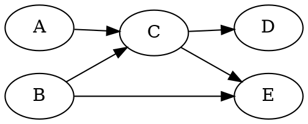

# Belief networks (Bayesian networks)

A DAG in which each node is associated with the conditional probability of the
node given its parents.

The [joint probability](202210090914) is obtained by taking the product of the conditional
probabilities:

$$
p(A,B,C,D,E) = p(A)p(B)p(C|A,B)p(D|C)p(E|B,C)
$$

Note that $p(A,B,C,D,E)$ is a distribution.

### Assumptions

When working with belief networks, it's important to list our assumptions.

E.g. suppose that we have a term like the following:

$$
\tag{1.0} P(A|B, C, D)
$$

And suppose we assume that $A$ is not directly influenced by $B$, i.e. $A$ is independent of $B$ given $C$ and $D$. We can rewrite
(1.0) as

$$
P(A|C, D)
$$

Also worthwhile leveraging independence, so if we assume that $B$ doesn't directly
"cause" $E$, then

$$
P(E|B) = P(E)
$$

We then use these assumptions to remove edges in our belief network and write
out the joint probability based on the updated network.
