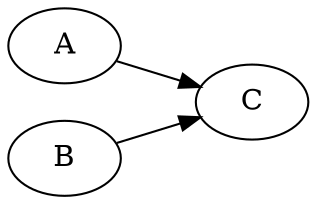
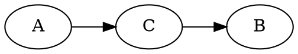

# Collider

A collider contains two or more incoming arrows along a chosen path.

Here, $A$ and $B$ are [marginally independent](202210071208) but not
[conditionally independent](202210071218) given $C$.

If $C$ has at most one incoming link, then $A$ and $B$ are conditionally
independent given $C$, but $A$ and $B$ are not marginally independent. In this
case $C$ is called a *non-collider*.

