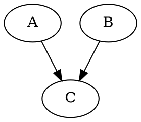
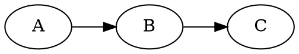
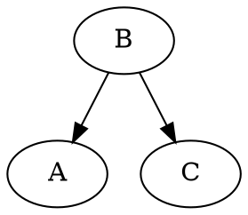
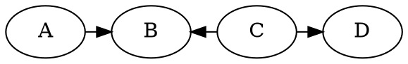

# Independence in belief networks

Consider the following [belief network](202210131116):

We have
$$
P(A,B,C) = P(A)P(B)P(C|A,B)
$$

In this network, $A$ is [independent](202210071208) of $B$ but $A$ is not
[conditionally independent](202210071218) of $B$ given $C$. To prove this, we
need to show that $P(A,B) = P(A)P(B)$:
$$
\begin{align*}
P(A,B) &= \sum_{C} P(A,B,C) \\[0.5em]
&= \sum_{C} P(A)P(B)P(C|B,A) \\[0.5em]
&= P(A)P(B) \underbrace{\sum_{C} P(C|B,A)}_{\text{sums to 1}} \\[0.5em]
&= P(A)P(B) \\[0.5em]
\end{align*}
$$

Now suppose we have this network:

Here, $P(A,B,C) = P(A)P(B|A)P(C|B)$ and $A$ is conditionally independent of $B$
given $C$ given $B$, however $A$ is not marginally independent of $C$. To prove
this, we need to show that $P(A,C|B)$ = $P(A|B)P(C|B)$: 

$$
\begin{align*}
P(A,C|B) &= \frac{P(A,B,C)}{P(B)} \\[0.5em]
&= \frac{P(A)P(B|A)P(C|B)}{P(B)} \\[0.5em]
&= \frac{P(A,B)}{P(B)}P(C|B) \\[0.5em]
&= P(A|B)P(C|B) \\[0.5em]
\end{align*}
$$

The same happens for the following network:

$A$ is conditionally independent of $B$ given $B$, but $A$ is not marginally
independent of $C$.

---

In order to obtain independence between to nodes $A$ and $D$, we want to "block"
the flow of information between the variables. They could be connected by
several different paths in the graph and all paths need to be blocked. There are
two situations when the path is blocked:

1. A non-[collider](202210131227) exists which is in the conditioning set
2. A collider exists but is outside the conditioning set

Consider the following network:

Our question is $A \perp D | B, C$? Answer, yes, because $C$ is a non-collider
which is in the conditioning set, therefore it "blocks" the flow of information.

What about $A \perp D$? Answer, yes, because $B$ is a collider which is outside
the conditioning set.

More formally, given three sets of nodes $\mathcal{X}, \mathcal{Y},
\mathcal{C}$, if all paths from any element of $\mathcal{X}$ to any element of
$\mathcal{Y}$ are blocked by $\mathcal{C}$, then $\mathcal{X}$ and $\mathcal{Y}$
are conditionally independent given $\mathcal{C}$.

A path $\mathcal{P}$ is blocked by $\mathcal{C}$ if at least one of the
following conditions is satisfied:

1. There is a collider in the path $\mathcal{P}$ such that neither the collider
   **nor any of its descendants** are in the conditioning set $\mathcal{C}$.
2. There is a non-collider in the path $\mathcal{P}$ that is in the conditioning
   set $\mathcal{C}$.
