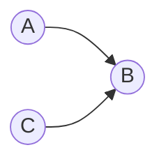

# Graphical dependence

Consider the distribution $(A|B)P(B|C)P(C)$:

Looking at the graph, $A$ and $C$ are [d-connected](202210191728.md) and are
therefore dependent.
However, there are settings of the distribution tables $P(A|B)$, $P(B|C)$ and
$P(C)$ such that $A$ and $C$ are independent. In this case, $A$ and $C$ are
_graphically dependent_.

Conversely, consider $P(B|A,C)P(A)P(C)$:

Here, $A$ and $C$ are d-separated and, no matter what the table settings are,
$A$ and $C$ are always independent. In this case, graphical independence
(d-separation) implies distribution independence.
