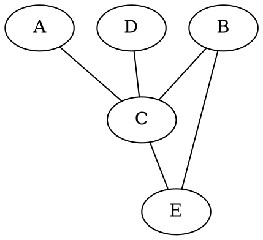
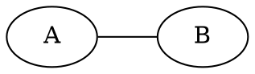

# Markov networks

An undirected [graph](202210191454.md.md) in which there is a potential
(non-negative function) $\psi$ defined on each [maximal
clique](202210131111.md.md).

The [joint distribution](202210081156.md.md) is proportional to the product of all
clique potentials

Here, the maximal cliques are $\left\{ A, C \right\}, \left\{ C, D \right\}$ and
$\left\{ B, C, E \right\}$, therefore:

$$
P(A,B,C,D,E) =  \frac{1}{Z} \psi(A,C)\psi(C,D)\psi(B,C,E)
$$

$$
Z = \sum_{A,B,C,D,E} \psi(A,C)\psi(C,D)\psi(B,C,E)
$$

### Example

Consider

With $A, B \in \left\{ 0, 1 \right\}$ and

$$
\psi(A,B) = \begin{cases}
  10 \text{ if } A = B \\[0.5em]
  1 \hspace{0.5em}  \text{ if } A \ne B
\end{cases}
$$

$$
Z = \sum_{A, B} \psi(A, B)= 22
$$

Therefore $P(A=1, B=1) = \frac{\psi(A=1, B=1)}{Z} = \frac{10}{22} = P(A=0, B=0)$
And clearly $P(A=1, B=0) = P(A=0, B=1) = \frac{1}{22}$
