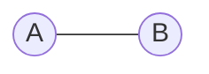
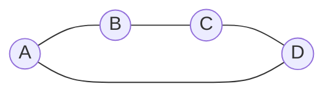

# Markov networks

An undirected [graph](202210191454.md) in which there is a potential
(non-negative function) $\psi$ defined on each [maximal clique](202210131111.md).

The [joint distribution](202210081156.md) is proportional to the product of all
clique potentials

Here, the maximal cliques are $\left\{ A, C \right\}, \left\{ C, D \right\}$ and
$\left\{ B, C, E \right\}$, therefore:

$$
P(A,B,C,D,E) =  \frac{1}{Z} \psi(A,C)\psi(C,D)\psi(B,C,E)
$$

$$
Z = \sum_{A,B,C,D,E} \psi(A,C)\psi(C,D)\psi(B,C,E)
$$

A potential $\psi$ is a function that takes a (non-negative) value for each
possible combination of values of its operands. E.g. for $\psi(A, C)$,
$\psi$ will have one value for $A = 0, C = 0$, one value for $A = 1, C = 0$,
etc. $Z$ is known as the *normalization constant* or *partition function*.

This can also be written as a [Gibbs distribution](202211141351.md):

$$
P(x_1, x_2, \ldots, x_{N}) = \frac{1}{Z}\exp \left[ -
\sum_{c=1}^{C} \phi_c \left[ x_1, x_2, \ldots, x_{N} \right]
\right]
$$

Where $\phi[x_1, x_2, \ldots, x_{N}] = -\log[\psi_c[x_1, x_2, \ldots, x_{N}]]$
and is referred to as a *cost function*.

### Example

Consider

With $A, B \in \left\{ 0, 1 \right\}$ and

$$
\psi(A,B) = \begin{cases}
  10 \text{ if } A = B \\[0.5em]
  1 \hspace{0.5em}  \text{ if } A \ne B
\end{cases}
$$

$$
Z = \sum_{A, B} \psi(A, B)= 22
$$

Therefore $P(A=1, B=1) = \frac{\psi(A=1, B=1)}{Z} = \frac{10}{22} = P(A=0, B=0)$
And clearly $P(A=1, B=0) = P(A=0, B=1) = \frac{1}{22}$

Suppose now that we have an extra two random variables:

Using the same $\psi$, we now have:

$$
P(A = 1, B = 1, C = 1, D = 1) = \frac{10^4}{Z}
$$

To compute $Z$ we need to sum over all possible combinations of $A, B, C, D$, a
bit tricky. But Markov nets give a way to compare probabilities, e.g. since 
$P(A = 1, B = 1, C = 1, D = 0) = \frac{10^2 \cdot 1\cdot 1}{Z}$, we know that
this is $10^2$ less likely to happen than the other other probability.

We can therefore generalize this as

$$
P(X) = \frac{P^*(X)}{Z}
$$

We know the distribution up to some constant $Z$, with $P^*(X)$ being the
product of the potentials for some configuration, which should be relatively
easy to compute.
