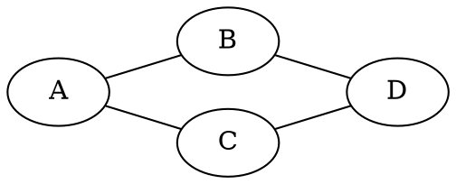

# Independence properties of Markov networks

Is $B \perp C|A, D$?  $P(B|A,D,C) = P(B|A,D)$?

$$
\begin{align*}
  P(B|A,D,C) &= \frac{P(A,B,C,D)}{P(A,C,D)} \\[1em]
  &= \frac{P(A,B,C,D)}{\sum_{B} P(A,B,C,D)} \\[1em]
  &= \frac{\psi(A,B)\cancel{\psi(A,C)}\psi(B,D)\cancel{\psi(C,D)}}
  {\sum_{B} \psi(A,B)\cancel{\psi(A,C)}\psi(B,D)\cancel{\psi(C,D)}} \\[1em]
  &= P(B|A,D) \\[1em]
\end{align*}
$$

As a general rule, remove all links neighbouring the variables in the
conditioning set $\mathcal{Z}$. If there is no path from any member of
$\mathcal{X}$ to any member of $\mathcal{Y}$, then $\mathcal{X}$ and
$\mathcal{Y}$ are conditionally independent given $\mathcal{Z}$ 

Is $\mathcal{X \perp \mathcal{Y}|\mathcal{Z}}$?

- Ancestral graph: Remove any node which is neither in $\mathcal{X \cup \mathcal{Y} \cup \mathcal{Z}}$ nor any ancestor of a node in this set, together with any edges in or out of such nodes

- Moralisation: Add a line between any two nodes which have a common child.
  Remove arrowheads

- Separation: Remove all links from $\mathcal{Z}$

- Independence: If there are no paths from any node in $\mathcal{X}$ to one in
  $\mathcal{Y}$ then $\mathcal{X} \perp \mathcal{Y} | Z$
