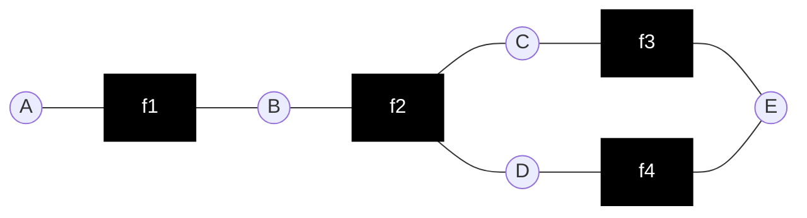
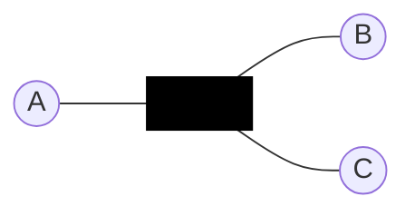
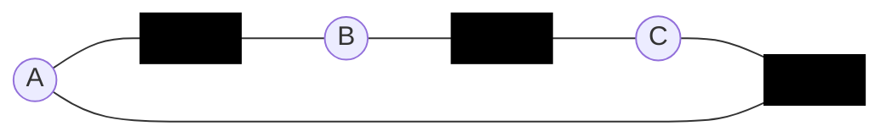
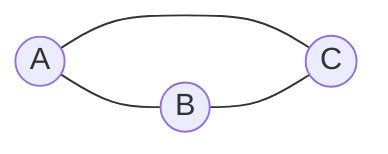

# Factor graphs

A square node represents a factor (non negative function) of its neighbouring
variables.

The joint function is a product of all the factors:

$$
f(A, B, C, D, E) = f_1(A, B)f_2(B, C, D)f_3(C, E)f_4(D, E)
$$

### Factor graphs vs. Markov networks

1.

$\phi(A, B, C)$

2.

$\phi(A, B)\phi(B, C)\phi(C, A)$

3.

$\phi(A, B, C)$

* Both 1 and 2 have the same [Markov network](202210201118.md) (3).
* Whilst 2 contains the same (lack of) independence statements as 1, it
expressed more constants in the form of the potential.
