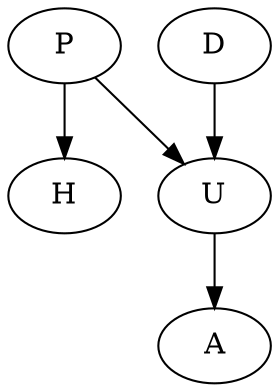

# Barber Book Exercises

### 2.1

$$
n_{i,j}^k = \sum_{l} \underbrace{A_{ij}}_{\text{1 timestep}}\overbrace{n_{lj}^{k
- 1}}^{\text{k-1 timesteps}}
$$

Can write this in matrix form

$$
\begin{align*}
N^k &= A N^{k-1} \\[0.5em]
&= A^2 N^{k-2} \\[0.5em]
&= A^k \\[0.5em]
\end{align*}
$$

### 2.3

We use proof by induction.

**Step 0**: Base case

Consider $V = 1$, so $E = 0$, therefore it holds for the base case.

**Step k**: Inductive step

Let $G'$ be a singly connected graph with $V'$ vertices and $E'$ edges. We "cut
out" the most outward node ($\overline{V}$) and corresponding edge, and call it
$G''$. By the inductive step we have number of vertices = $V$ and number of
edges = $V-1$. Therefore number of vertices in $G'$ is $V+1$ and number of edges
in $G'$ is $V$.

### 3.1

From the graph, we have that

$$
P(P, A, D, H, U) = P(D)P(P)P(U|D,P)P(H|P)P(A|U)
$$

We are looking for $P(P=T|A=T,H=T)$

$$
\begin{align*}
P(P=T|A=T,H=T) &= \frac{P(P=T,A=T,H=T)}
{P(A=T,H=T)} \\[0.5em]
\end{align*}
$$

Need to marginalize over the terms we don't have in the numerator
