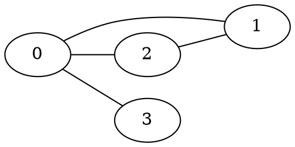

# Adjacency matrix

An adjacency matrix $A$ represents a [graph](202210191454) where the value of
$A_{ij}$ is either 1 or 0 depending on whether there is an edge from vertex $i$
to $j$.

Is represented by

$$
\begin{bmatrix}
0 & 1 & 1 & 1 \\
1 & 0 & 1 & 0 \\
1 & 1 & 0 & 0 \\
1 & 0 & 0 & 0 \\
\end{bmatrix}
$$

