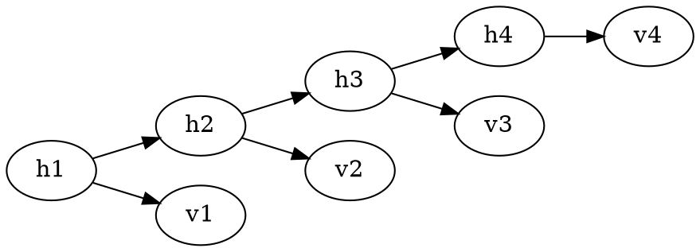

# Hidden Markov models

The HMM defines a [Markov chain](202210201823.md) on hidden variables $h_{1:T}$.
The observed variables depend on the hidden variables through an emission
$P(v_t|h_t)$. This defines a joint distribution

$$
P(h_{1:T},v_{1:T}) = P(v_1|h_1)P(h_1)\prod_{t=2}^{T} P(v_t|h_t)P(h_t|h_{t-1})
$$

And $P(h_t|h_{t-1})$ and $P(v_t|h_t)$ are constant through time (stationarity).

Above is a first order hidden Markov model with 'hidden' variables 
$\text{dom}(h_t) = \left\{ 1, \ldots, H \right\}, t = 1 : T$. The 'visible'
variables $v_t$ can either be discrete or continuous.
