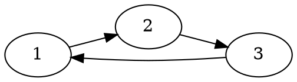

# Equilibrium distribution

Interesting to see how the marginal $P(x_t)$ evolves through time:

$$
p(x_t = i) = \sum_{j} \underbrace{p(x_t = i|x_{t-1} = j)}_{M_{ij}}p(x_{t-1} = j)
$$

$p(x_t = i)$ is the frequency that we visit state $i$ at time $t$, given that we
started from $p(x_1)$ and randomly draw samples from the transition $p(x_T|x_{T-1})$

As we repeatedly sample a new state from the chain, the distribution at time
$t$, for an initial distribution $\bold{p}_i(i)$ is $\bold{p}_t =
\bold{M}^{t-1}\bold{p_1}$.

If, for $t \rightarrow \infty$, $\bold{p}_{\infty}$ is independent of the
initial distribution $\bold{p}_i$, then $\bold{p}_{\infty}$ is called the
equilibrium distribution of the chain:

$$
\bold{p}_{\infty} = \bold{M}\bold{p}_{\infty}
$$

The equilibrium distribution is proportional to the
[eigenvector](202210271132.md) with unit [eigenvalue](202210271133.md) of the
transition matrix.

Consider

Then the transition matrix $\bold{M}$ is given by

$$
M = \begin{pmatrix}
0 & 0 & 1 \\
1 & 0 & 0 \\
0 & 1 & 0 \\
\end{pmatrix}
$$

The first col represents which state you'll go to if you're in state 1 (= state 2
with probability 1).
