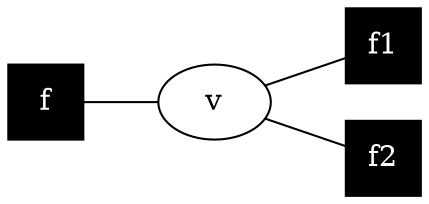
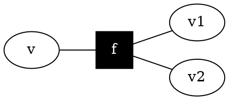

# Sum-product algorithm

Relates to [factor graphs](202210201238.md), where $\mu$ is a *message*.

### Variable to factor message

$$
\mu_{v \rightarrow f}(v) = \prod_{f_i \backsim v \setminus f} \mu_{f_i
\rightarrow v}(v)
$$

Messages from extremal variables are set to 1

### Factor to variable message

$$
\mu_{f \rightarrow v}(v) =
\sum_{\left\{ v_i \right\}} f(v, \left\{ v_i \right\})
\prod_{f_i \backsim f \setminus v} \mu_{v_i \rightarrow f}(v_i)
$$

Messages from extremal factors are set to the factor

### Marginal

$$
p(v) \propto \prod_{f_i \backsim v} \mu_{f_i \rightarrow v}(v)
$$

