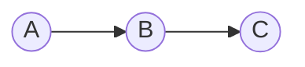
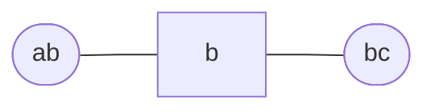

# Absorption

### Example

$$
p(a,b,c) = \underbrace{p(a)p(b|a)}_{\psi(a,b)}\underbrace{p(c|b)}_{\psi(b,c)}
$$

As a clique graph:

$$
\begin{align*}
\psi(a,b) &= p(a)p(b|a) \\[0.5em]
\psi(b,c) &= p(c|b) \\[0.5em]
\psi(b) &= 1 \\[0.5em]
\end{align*}
$$
