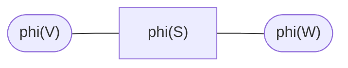
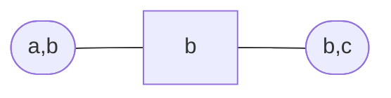

# Absorption

Consider neighbouring [cliques](202210131111.md) $\mathcal{V}$ and
$\mathcal{W}$, sharing the variables $\mathcal{S}$ in common. So

$$
p(\mathcal{X}) = \frac{\phi(\mathcal{V})\phi(\mathcal{W})}{\phi(\mathcal{S})}
$$

Our aim is to find a new representation

$$
p(\mathcal{X}) = \frac{\hat{\phi}(\mathcal{V})\hat{\phi}(\mathcal{W})}
{\hat{\phi}(\mathcal{S})}
$$

In which the potentials are given by

$$
\hat{\phi}(\mathcal{V}) = p(\mathcal{V}), \hspace{1em}
\hat{\phi}(\mathcal{W}) = p(\mathcal{W}), \hspace{1em}
\hat{\phi}(\mathcal{S}) = p(\mathcal{S})
$$

This can be done by

$$
\begin{equation}
\begin{align*}
p(\mathcal{W}) &= \sum_{\mathcal{V}\setminus\mathcal{S}}p(\mathcal{X}) \\[0.5em]
&= \sum_{\mathcal{V}\setminus\mathcal{S}}
\frac{\phi(\mathcal{V})\phi(\mathcal{W})}{\phi(\mathcal{S})} \\[0.5em]
&= \phi(\mathcal{W})\frac{\sum_{\mathcal{V}\setminus\mathcal{S}}\phi(\mathcal{V})}
{\phi(\mathcal{S})} \\[0.5em]
\end{align*}
\end{equation}
$$

With a similar calculation for $p(\mathcal{V})$ by switching $\mathcal{V}$ and
$\mathcal{W}$.

This is known as absorption, clique $\mathcal{W}$ *absorbs* information from 
clique $\mathcal{V}$. Another way to go about this is by first defining a new
separator:

$$
\begin{equation}
\phi^*(\mathcal{S}) = \sum_{\mathcal{V}\setminus\mathcal{S}} \phi(\mathcal{V})
\end{equation}
$$

And then redefine the $\mathcal{W}$ potential using

$$
\begin{equation}
\phi^*(\mathcal{W}) = \phi(\mathcal{W})
\frac{\phi^*(\mathcal{S})}{\phi(\mathcal{S})}
\end{equation}
$$

Which comes from $(1)$.

After $\mathcal{W}$ absorbs information from $\mathcal{V}$, then 
$\phi^*(\mathcal{W})$ contains the marginal $p(\mathcal{W})$. Similarly, after 
$\mathcal{V}$ absorbs information from $\mathcal{W}$ then $\phi^*(\mathcal{V})$
contains the marginal $p(\mathcal{V})$. After the separator $\mathcal{S}$ has
participated in absorption along both directions, then the separator potential
will contain $p(\mathcal{S})$.

### Example

Using the clique graph from the [clique graph](202211031127.md) example

$$
\begin{align*}
\phi^*(b) &= \sum_{a} p(a)p(b|a) = p(b) \hspace{1em} \text{ (using (2))} \\[0.5em]
\phi^*(b,c) &= p(c|b) \frac{p(b)}{1} = p(c,b) \hspace{1em} \text{ (using (3))} \\[0.5em]
\end{align*}
$$

We don't need to define a $\phi^*(a,b)$ because $\phi(a,b)$ is already a
distribution.
