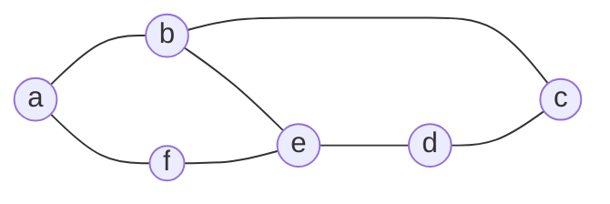

# Triangulation

In a triangulated graph, every loop of length 4 must have a chord (a shortcut).
Such graphs are called *decomposable*.

This is a non-decomposable graph. Adding edges from $a$ to $e$ and $b$ to $d$
makes it a triangulated version.
