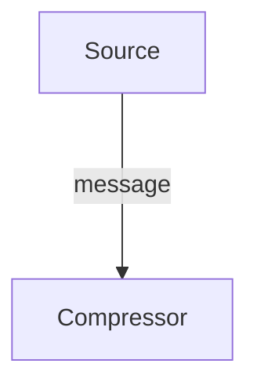

# Information theory

For a random variable $X$, consider $p(X=a)$. The information content of an
outcome $X=a$ is

$$
\log_2 = \frac{1}{p(X=a)}
$$

For independent variables $X$ and $Y$:

$$
\begin{align*}
\log_2 \frac{1}{p(X=a, Y=b)} &= \log_2 \frac{1}{p(X=a)p(Y=b)} \\[0.5em]
&= \log_2 \frac{1}{p(X=a)} + \log_2 \frac{1}{p(Y=b)}  \\[0.5em]
\end{align*}
$$

