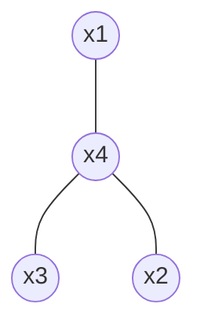
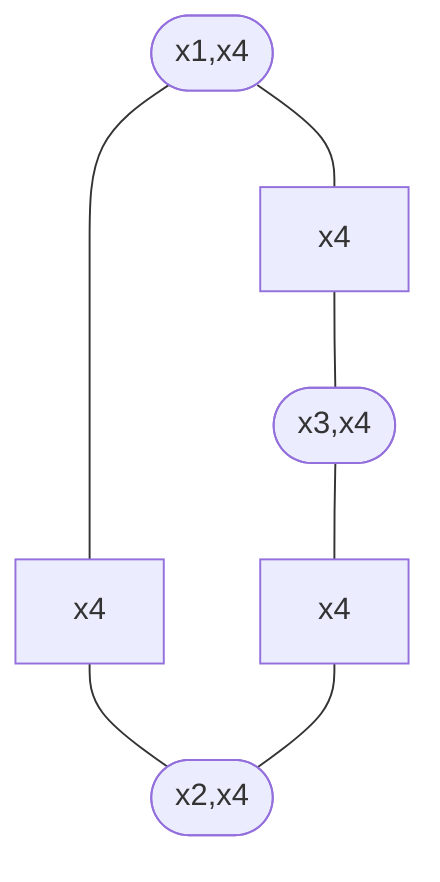
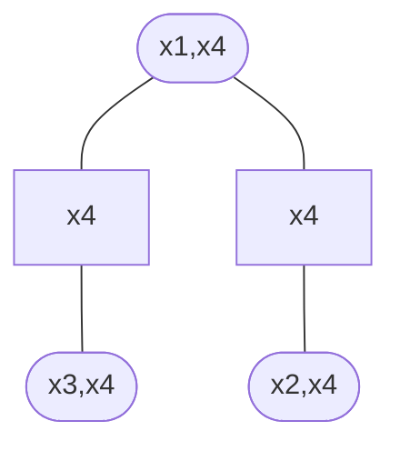

# Clique tree

A clique tree is a singly connected clique graph.

Consider a [Markov network](202210201118.md):

With a joint distribution of
$p(x_1, x_2, x_3, x_4) = \phi(x_1, x_4)\phi(x_2, x_4)\phi(x_3, x_4)$.

This can be represented with a [clique graph](202211031127.md)

The clique graph of this singly-connected Markov net is multiply-connected,
where the separator potentials are all set to unity.

For [absorption](202211031203.md) to work, we need a singly-connected clique
graph.

To do this we need to reexpress the Markov net in terms of marginals. Can be
shown that

$$
p(x_1, x_2, x_3, x_4) = \frac{p(x_1, x_4)p(x_2,x_4)p(x_3,x_4)}
{p(x_4)p(x_4)}
$$

Which is represented by the clique graph

This means that if a variable (here $x_4$) occurs in every separator in a clique
graph loop one can remove that variable from an arbitrarily chosen separator in
the loop. Therefore, if a Markov net is singly connected, then we can form a
clique tree in this manner.
