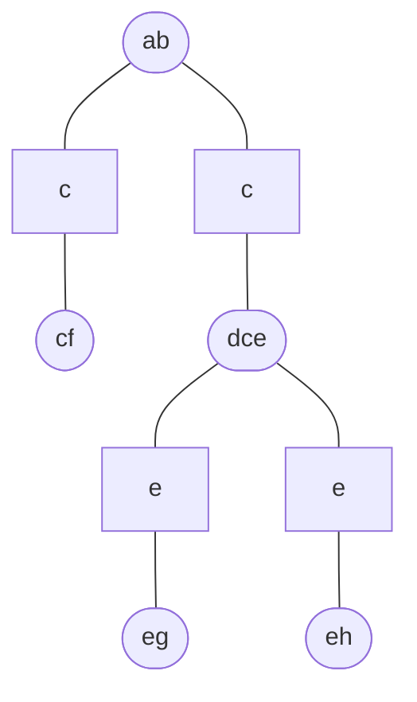

# Junction tree

A [clique tree](202211051147.md) is a junction tree if, for each pair of nodes,
$\mathcal{V}$ and $\mathcal{W}$, all nodes on the path between $\mathcal{V}$ and
$\mathcal{W}$ contain the intersection $\mathcal{V} \cap \mathcal{W}$. This is
known as the *running intersection property*.

Any singly-connected [Markov network](202210201118.md) can be transformed into a
junction tree.
