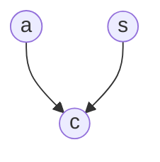

# ML training of belief networks

For a [belief net](202210131116.md) like the following:

And suppose we have a distribution like so

|a|s|c|
|---|---|---|
|1|1|1|
|1|0|0|
|0|1|1|
|0|1|0|
|1|1|1|
|0|0|0|
|1|0|1|

To learn the entries $p(c|a,s)$ we do so by counting the number of times $c$ is
in state $1$ for each of the 4 parental states of $a$ and $s$:

$$
\begin{align*}
p(c = 1|a = 0, s = 0) = 0, \hspace{2em} &p(c = 1|a = 0, s = 1) = 0.5 \\[0.5em]
p(c = 1|a = 1, s = 0) = 0.5, \hspace{1.5em} &p(c = 1|a = 1, s = 1) = 1 \\[0.5em]
\end{align*}
$$

With $p(a) = 4/7$ and $p(s) = 4/7$

### Using KL divergence

Maximum likelihood corresponds to setting $p$ to the empirical distribution, so
that the optimal BN terms are given by

$$
p(x_i = s|\text{pa}(x_i) = t) \propto
\sum_{n=1}^{N} \mathbb{I}[x_i^n = \bold{s}]
\prod_{x_j \in \text{pa}(x_i)} \mathbb{I}[x_j^n = \bold{t}^j] 
$$

The table entry $p(x_i|\text{pa}(x_i))$ can be set by counting the number of
times the state $\left\{ x_i = \bold{s}, \text{pa}(x_i) = \bold{t} \right\}$
occurs in the dataset (where $\bold{t}$ is a vector of parental states). The
table is then given by the relative number of counts of being in state $\bold{s}$
compared to the other states $\bold{s}'$, for fixed joint parental state
$\bold{t}$.
