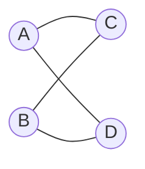
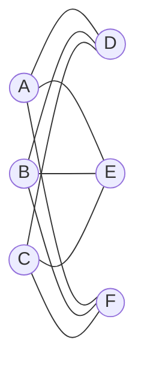
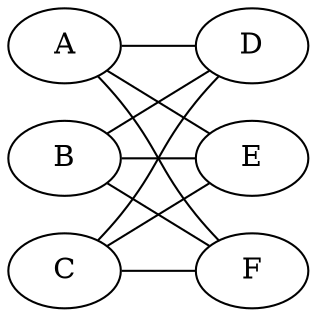

### 2.1

$$
n_{i,j}^k = \sum_{l} \underbrace{A_{ij}}_{\text{1 timestep}}\overbrace{n_{lj}^{k
-1}}^{\text{k-1 timesteps}}
$$

Can write this in matrix form

$$
\begin{align*}
N^k &= A N^{k-1} \\[0.5em]
&= A^2 N^{k-2} \\[0.5em]
&= A^k \\[0.5em]
\end{align*}
$$

### 2.3

We use proof by induction.

**Step 0**: Base case

Consider $V = 1$, so $E = 0$, therefore it holds for the base case.

**Step k**: Inductive step

Let $G'$ be a singly connected graph with $V'$ vertices and $E'$ edges. We "cut
out" the most outward node ($\overline{V}$) and corresponding edge, and call it
$G''$. By the inductive step we have number of vertices = $V$ and number of
edges = $V-1$. Therefore number of vertices in $G'$ is $V+1$ and number of edges
in $G'$ is $V$.

### 2.8

Start with small $N$, e.g. $N = 2$, this gives us 1 maximal clique.

For $N = 4$:

Each edge represents a maximal clique, therefore 4 maximal cliques.

For $N = 6$:

Again each edge represents a maximal clique, therefore 9 maximal cliques.

