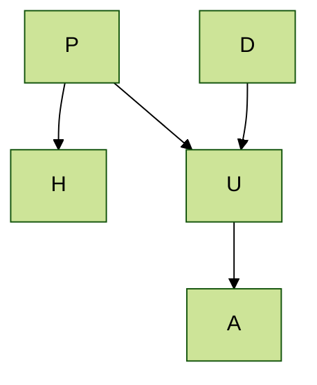

### 3.1

From the graph, we have that

$$
P(P, A, D, H, U) = P(D)P(P)P(U|D,P)P(H|P)P(A|U)
$$

We are looking for $P(P=T|A=T,H=T)$

$$
\begin{align*}
P(P=T|A=T,H=T) &= \frac{P(P=T,A=T,H=T)}
{P(A=T,H=T)} \\[0.5em]
\end{align*}
$$

Need to marginalize over the terms we don't have in the numerator

