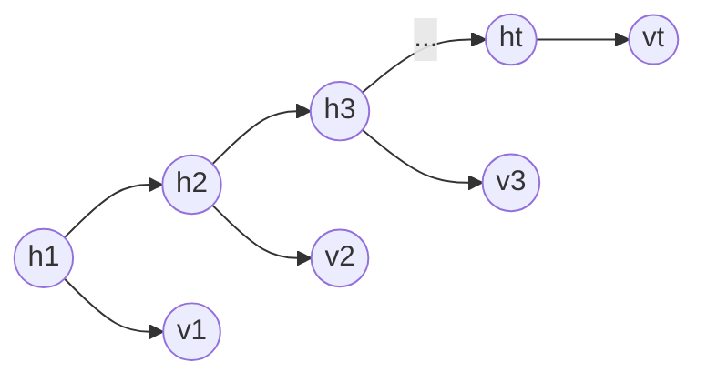

### 5.4

```mermaid
flowchart LR
  h1((h1))-->h2((h2))
  h1-->v1((v1))
  h2-->h3((h3))
  h2-->v2((v2))
  h3-- ... -->ht((ht))
  h3-->v3((v3))
  ht-->vt((vt))
```

We're looking for $p(h_t|v_1, \ldots, v_T)$.

Note that

$$
p(h_{1:T}|v_{1:T}) \propto p(h_{1:T},v_{1:T})
$$

