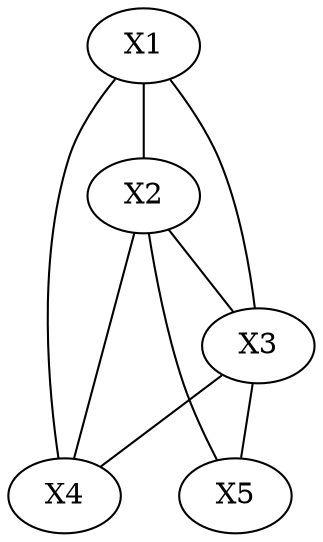

# Clique

A fully connected subset of nodes - every node is connected to every other node.
($X1, X2, X4$) forms a clique.

A clique which is not a subset of a larger clique is a *maximal clique*. ($X1,
X2, X3, X4$) and ($X2, X3, X5$) are both maximal cliques; adding any other node
will make it a non clique
