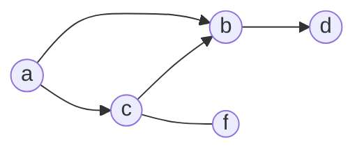

# Graph

A graph consists of nodes (vertices) and undirected or directed links (edges)
between nodes.

A path from $X_i$ to $X_j$ is a sequence of connected nodes starting at $X_i$
and ending at $X_j$.

$X_i$ is a _parent_ of $X_j$ if there is a link from $X_i$ to $X_j$. $X_i$ is a
_child_ of $X_j$ if there is a link from $X_j$ to $X_i$.

The ancestors of a node $X_i$ are the nodes with a directed path ending at
$X_i$. The descendants of $X_i$ are the nodes with a directed path beginning at
$X_i$.

A *connected* graph is graph where every node is connected to every other node.

A graph is *singly-connected* if there is only one path from any node to any
other node. The opposite is known as a *multiply-connected* graph.

A *tree* is an undirected graph in which any two vertices are connected by
exactly one path.
