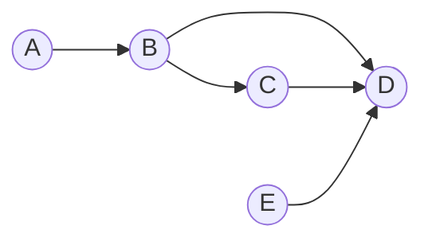
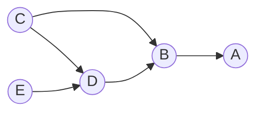

# Markov equivalence

Two [graphs](202210191454.md) represent the same set of independence assumptions if
and only if they have the same [skeleton](202210191745.md) and the same set of
[immoralities](202210191746.md).

The following two graphs are **not** Markov equivalent:

They have the same skeleton, but the first graph has an immorality $\left\{ D,
E, B \right\}$, which the second graph does not have.
