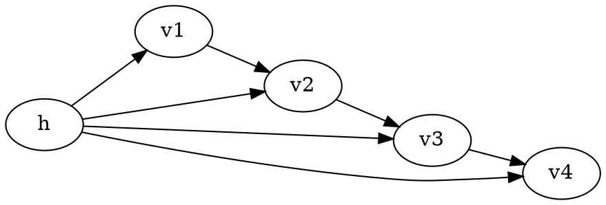

# Mixture of Markov models

The discrete hidden variable $\text{dom}(h) = \left\{ 1, \ldots, H \right\}$
indexes the [Markov chain](202210201823.md)

$$
\prod_{t} P(v_t|v_{t-1},h)
$$

So

$$
P(v_{1:T}) = \sum_{h=1}^{H} P(h)P(v_{1:T}|h)
= \sum_{h=1}^{H} P(h) \prod_{1=1}^{T} P(v_t|v_{t-1},h)
$$

Clustering for $h$ can be achieved by finding the [maximum likelihood](202210101331.md)
parameters $P(h), P(v_t|v_{t-1},h)$ and subsequently assigning the clusters
according to $P(h|v_{1:T}^n)$.
