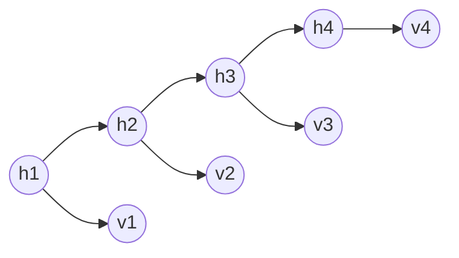

# Hidden Markov models

The HMM defines a [Markov chain](202210201823.md) on hidden variables $h_{1:T}$.
The observed variables depend on the hidden variables through an emission
$P(v_t|h_t)$. This defines a joint distribution

$$
\begin{equation}
P(h_{1:T},v_{1:T}) = P(v_1|h_1)P(h_1)\prod_{t=2}^{T} P(v_t|h_t)P(h_t|h_{t-1})
\end{equation}
$$

And $P(h_t|h_{t-1})$ and $P(v_t|h_t)$ are constant through time (stationarity).

Above is a first order hidden Markov model with 'hidden' variables
$\text{dom}(h_t) = \left\{ 1, \ldots, H \right\}, t = 1 : T$. The 'visible'
variables $v_t$ can either be discrete or continuous.

### MAP inference

We rewrite $(1)$ as

$$
\begin{align*}
P(\bold{x}_{1\ldots N},w_{1\ldots N}) &= \left(
\prod_{n=1}^{N} P(\bold{x}_n|w_n)
\right) \left(
\prod_{n=2}^{N} P(w_n|w_{n-1})
\right)   \\[0.5em]
\end{align*}
$$

Here we have assumed the $P(w_1)$ term is an uninformative prior and we can just
remove it.

For [MAP](202210101339.md) inference

$$
\begin{align*}
\hat{w}_{1\ldots N} &= \argmax_{w_{1\ldots N}}P(w_{1\ldots N}|\bold{x}_{1\ldots N}) \\[0.5em]
&= \argmax_{w_{1\ldots N}}P(\bold{x}_{1\ldots N}, w_{1\ldots N}) \\[0.5em]
&= \argmin_{w_{1\ldots N}} - \log [P(\bold{x}_{1\ldots N},w_{1\ldots N})]\\[0.5em]
\end{align*}
$$

Substituting in:

$$
\hat{w}_{1\ldots N} =
\argmin_{w_{1\ldots N}} \left[ -
\sum_{n=1}^{N} \log [P(\bold{x}_n|w_n)] - \sum_{n=2}^{N} \log[P(w_n|w_{n-1})]
\right]
$$

Takes the general form

$$
\hat{w}_{1\ldots N} =
\argmin_{w_{1\ldots N}} \left[
\sum_{n=1}^{N} U_n(w_n) + \sum_{n=2}^{N} P_n(w_n,w_{n-1})
\right]
$$

Where

$$
\begin{align*}
\text{Unary term:} \hspace{3.5em} U_n(w_n) &= -\log[P(\bold{x}_n|w_n)] \\[0.5em]
\text{Pairwise term:} \hspace{1em} P_n(w_n,w_{n-1}) &= -\log[P(w_n|w_{n-1})] \\[0.5em]
\end{align*}
$$

