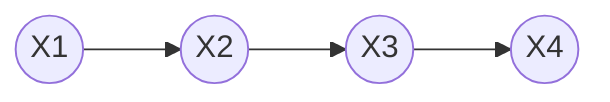
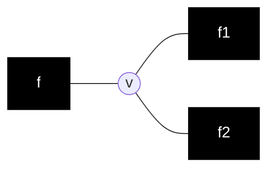
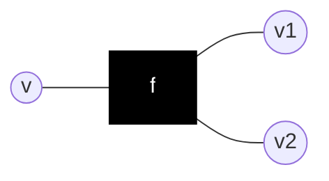

# Sum-product algorithm

Relates to [factor graphs](202210201238.md), where $\mu$ is a *message*.

## Non-branching tree

### Example

Consider the following [Markov chain](202210201823.md):

The joint distribution is given by:

$$
p(x_1, x_2, x_3, x_4) = p(x_1)p(x_2|x_1)p(x_3|x_2)p(x_4|x_3)
$$

Let's say we're interested in $p(x_3)$:

$$
p(x_3) = \sum_{x_1, x_2, x_4} p(\bold{x})
$$

We know that $x_3$ will receive messages from both sides, one from $x_4$ and one
from $x_1$ and $x_2$.

$$
\begin{align*}
\mu_{x_{4} \rightarrow x_{3}}(x_{3}) &= \sum_{x_4} p(x_4|x_3) = \bold{1} \\[0.5em]
\mu_{x_{1} \rightarrow x_{2}}(x_{2}) &= \sum_{x_1} \underbrace{p(x_1)p(x_2|x_1)}_{p(x_1,x_2)} = p(x_2) \\[0.5em]
\mu_{x_{2} \rightarrow x_{3}}(x_{3}) &= \sum_{x_2} \mu_{x_{1} \rightarrow x_{2}}(x_{2})p(x_3|x_2) \\[0.5em]
&= \sum_{x_2} p(x_2)p(x_3|x_2) = p(x_3) \\[0.5em]
\Rarr \mu_{x_{2} \rightarrow x_{3}}(x_{3}) \cdot \mu_{x_{4} \rightarrow x_{3}}(x_{3})
&= \bold{1} \cdot p(x_3) = p(x_3) \\[0.5em]
\end{align*}
$$

## Branching tree

For factor graphs, messages can be passed from variables to factors and
vice-versa.

### Variable to factor message

$$
\begin{align*}
\mu_{v \rightarrow f}(v) &= \prod_{f_i \backsim v \setminus f} \mu_{f_i
\rightarrow v}(v) \\[0.5em]
&= \mu_{f_{1} \rightarrow v}(v) \cdot \mu_{f_{2} \rightarrow v}(v) \\[0.5em]
\end{align*}
$$

Messages from extremal variables are set to 1

### Factor to variable message

$$
\mu_{f \rightarrow v}(v) =
\sum_{\left\{ v_i \right\}} f(v, \left\{ v_i \right\})
\prod_{f_i \backsim f \setminus v} \mu_{v_i \rightarrow f}(v_i)
$$

Messages from extremal factors are set to the factor

### Marginal

$$
p(v) \propto \prod_{f_i \backsim v} \mu_{f_i \rightarrow v}(v)
$$

