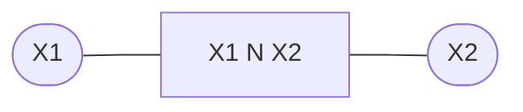
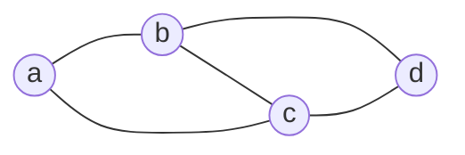
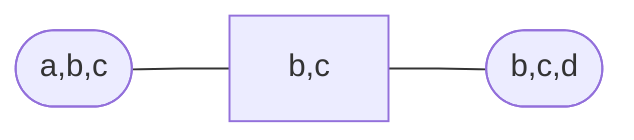
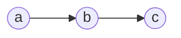
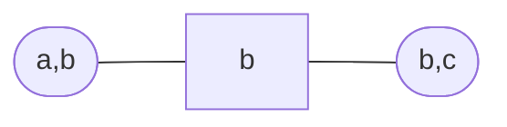

# Clique graph

Consists of a set of potentials,
$\phi_1(\mathcal{X}^1), \ldots, \phi_n(\mathcal{X})^n$. For neighbouring 
[cliques](202210131111.md) on a graph, defined on sets of variables
$\mathcal{X}^i$ and $\mathcal{X}^j$, the intersection $\mathcal{X}^s =
\mathcal{X}^i \cap \mathcal{X}^j$ is called a *separator* and has a
corresponding potential $\phi_s(\mathcal{X}^s)$.

A clique graph represents the function

$$
\frac{\prod_{c} \phi_c(\mathcal{X}^c)}
{\prod_{s} \phi_c(\mathcal{X}^s)}
$$

$$
\frac{\phi(\mathcal{X}^1)\phi(\mathcal{X}^2)}
{\phi(\mathcal{X}^1 \cap \mathcal{X}^2)}
$$

### Markov net -> clique graph

For a [Markov network](202210201118.md) like the following:

We have:

$$
p(a, b, c, d) = \frac{\psi(a, b, c)\psi(b, c, d)}{Z}
$$

This can be represented with a clique graph

The separator potential may be set to the normalisation constant $Z$. Cliques
have potentials $\psi(a,b,c)$ and $\psi(b,c,d)$.

It can be shown that

$$
\begin{align*}
p(a,b,c,d) &= \frac{\psi(a,b,c)\psi(b,c,d)}{Z} \\[0.5em]
&\vdots \\[0.5em]
&= \frac{p(a,b,c)p(b,c,d)}{p(c,b)} \\[0.5em]
\end{align*}
$$

This is consistent with our definition of a clique graph.

So 

$$
\begin{align*}
\psi(a,b,c) &\rightarrow p(a,b,c) \\[0.5em]
\psi(b,c,d) &\rightarrow p(b,c,d) \\[0.5em]
Z &\rightarrow p(c,b)
\end{align*}
$$

Now if we are interested in the marginal $p(a,b,c)$  this can be read off from
the transformed clique potential.

### Example

For a graph

With distribution $p(a)p(b|a)p(c|b)$. We can represent this with the clique
graph

And we have

$$
\psi(a,b) = p(a)p(b|a), \hspace{1em} \psi(b,c) = p(c|b), \hspace{1em} \psi(b) = 1
$$

And we can rewrite the distribution $p(a)p(b|a)p(c|b)$ as

$$
p(a,b)p(c|b) = p(a,b) \frac{p(c,b)}{p(b)}
$$

Therefore

$$
\psi^*(a,b)=p(a,b), \hspace{1em} \psi^*(b,c)=p(b,c), \hspace{1em} \psi^*(b) = p(b)
$$

