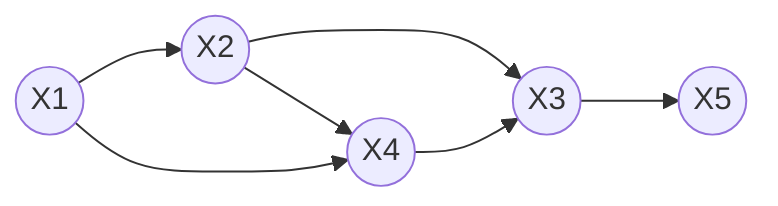

# Ancestral sampling

A method of sampling from a directed model:
* work through a graphical model, sampling one variable at a time
* always sample parents before sampling variable
* condition on previously sampled values

Has a distribution of

$$
P(x_1, x_2, x_3, x_4, x_5) = P(x_1)P(x_2|x_1)P(x_3|x_4,x_2)P(x_4|x_2,x_1)P(x_5|x_3)
$$

To generate a sample:
1. Sample $x_1^*$ from $P(x_1)$
2. Sample $x_2^*$ from $P(x_2|x_1^*)$
3. Sample $x_4^*$ from $P(x_4|x_1^*,x_2^*)$
4. etc.
