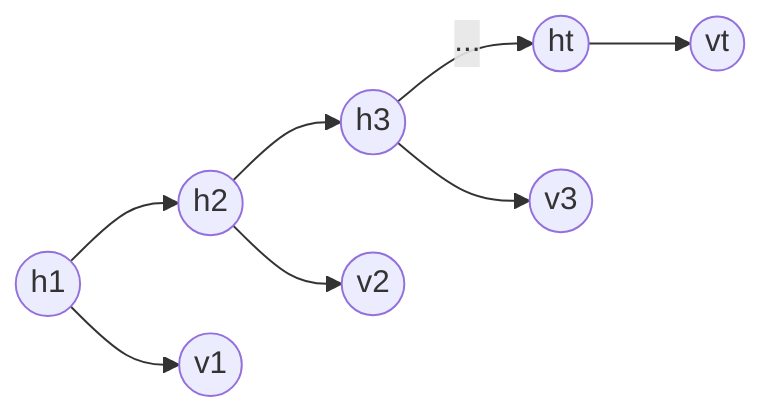

# Baum-Welch algorithm

Recall from [Hidden Markov models](202210261811.md):

We use a transmission matrix $A$ to denote the probability of transitioning from
$h_i$ to $h_j$ and we use an emission matrix $B$ to denote the probability of 
observing $v_j$ given a state $h_j$ 

Baum-Welch is a type of [expectation maximization](202210250932.md) for HMM, for
each step of Baum-Welch need to use [Forward-Backward algorithm](202211241752.md)
to estimate the forward and backward probabilities at each time step. It uses
those fit the model parameters.
