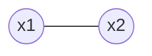

# Spin systems

Consider a [Markov net](202210201118.md) on binary variables with distribution

$$
P(x) = \frac{e^{-\beta E(x)}}{Z}
$$

Where $E(x|J,b) = -\frac{1}{2}\sum_{m,n} J_{mn}x_mx_n - \sum_{n} b_nx_n$. This
is a distribution on a lattice / grid of variables.

## Example: smallest possible Markov net / spin system

And we have $J = 1$.

* two binary variables $x_1, x_2 \in \left\{ -1, +1 \right\}$
* $p(x_1, x_2) = \frac{e^{\beta x_1 x_2}}{Z}$, $\beta$ is a temperature (or
rather coolness) parameter

What does the distribution look like?

We have 4 possible states, and we know that
$p(x_1 = -1, x_2 = -1) = p(x_1 = 1, x_2 = 1)$, so

$$
p(x_1=x_2) = \frac{e^{\beta}}{Z'}, \hspace{1em}
p(x_1 \ne x_2) = \frac{e^{-\beta}}{Z'}
$$

Therefore $Z' = e^{\beta} + e^{-\beta}$

So

$$
\begin{equation}
p(x_1, x_2) = \frac{e^{\beta x_1 x_2}}{2(e^{\beta} + e^{-\beta})}
\end{equation}
$$

Can verify $(1)$ is a distribution by ensuring that it sums to 1 over all the
possible states.

Note that as $\beta \rightarrow \infty$, then $p(x_1=x_2) \rightarrow 1$.

We now assume that this is a "scary" distribution and we want to approximate it
using [mean field approximation](202211301700.md). So we want to find $q(x)$
such that $q(x_1, x_2) = q(x_1)q(x_2)$.

Could say

$$
q_i(x_i = 1) := q_i, \hspace{1em} q_i \in [0,1]
$$

We have that

$$
\overline{x}_i = \left< x_i \right>_{q_i} = 1 \cdot q_i + (-1) \cdot (1 - q_i) = 
2q_i - 1
$$

Where $\overline{x}_i$ are known as the mean parameters.

The entropy of $q$ is

$$
\begin{align*}
H_2(q_i) &= -q_i \log q_i - (1-q_i) \log (1-q_i) \\[0.5em]
H_2'(q_i) &= -[\log q_i + 1] - [-\log(1-q_i) - 1] \\[0.5em]
&= \log \frac{1 - q_i}{q_i} \\[0.5em]
\end{align*}
$$

The free energy is a function of $q$

$$
\begin{align*}
F(q) = F(q_1, q_2) &= H_2(q_1) + H_2(q_2) + \underbrace{\beta\sum_{x_1,x_2} q_2(x_1)q_2(x_2)x_1x_2
}_{\beta \overline{x}_1 \overline{x}_2} \\[0.5em]
&= H_2(q_1) + H_2(q_2) + \beta(2q_1 - 1)(2q_2 - 1) \\[0.5em]
\end{align*}
$$

Taking the derivative and setting to 0

$$
\begin{align*}
H_2'(q_1) + 2\beta \overline{x}_2 &= 0 \\[0.5em]
\log \frac{q_1}{1 - q_1} &= 2 \beta x_2 \\[0.5em]
q_1 &= \frac{e^{2\beta \overline{x}_2}}{1 + e^{2 \beta \overline{x}_2}} \\[0.5em]
\overline{x}_1 &= 2q_1 - 1 = \frac{e^{2\alpha_1} - 1}{e^{2\alpha_1} + 1} = \tanh (\alpha_1) \\[0.5em]
\end{align*}
$$

